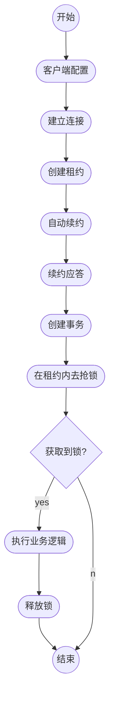

ETCD是一个高度一致的分布式键值存储, 它提供了一种可靠的方式来存储需要由分布式系统或机器集群访问的数据(高可用, 强一致性)​全局的配置服务中心. 本文将介绍其特性、相关操作和常见的应用场景.
<!-- more -->


## 特性
不能存储大量的具体数据, 应用来存储少量重要的数据

## 相关操作
### 写

```shell
$ ETCDctl put foo bar
OK
```

### 读

​在HTTP请求体中的JSON对象, 其包含的key和value字段都被定义成了byte数组, 因此必须在JSON对象中, 使用base64编码对内容进行处理

```shell
$ ETCDctl get foo
foo
bar
```

这是**只读取键** foo 的值的命令: 

```shell
$ ETCDctl get foo --print-value-only
bar
```

键 foo 到foo3的值的命令: 

```shell
$ ETCDctl get foo foo3
foo
bar
foo1
bar1
foo2
bar2
### 半开区间 [foo, foo3)
```

范围覆盖以 `foo` 为前缀的所有键的命令, 结果数量限制为2: 

```shell
$ ETCDctl get --prefix --limit=2 foo
foo
bar
foo1
bar1

$ ETCDctl get key -w json
```

### 版本(revision)

每put一次相同的key都会修改该key的版本

```shell
$ ETCDctl get --prefix foo # 访问键的最新版本
foo
bar_new
foo1
bar1_new

$ ETCDctl get --prefix --rev=4 foo # 访问修订版本为 4 时的键的版本
foo
bar_new
foo1
bar1

$ ETCDctl get --prefix --rev=3 foo # 访问修订版本为 3 时的键的版本
foo
bar
foo1
bar1

$ ETCDctl get --prefix --rev=2 foo # 访问修订版本为 2 时的键的版本
foo
bar

$ ETCDctl get --prefix --rev=1 foo # 访问修订版本为 1 时的键的版本
```

### 观察(watch)

watch key

观察多个键 `foo` 和 `zoo` 的命令:

```shell
$ ETCDctl watch -i
$ watch foo
$ watch zoo
# 在另外一个终端: ETCDctl put foo bar
PUT
foo
bar
# 在另外一个终端: ETCDctl put zoo val
del
zoo
val
```

观察历史改动: 

```shell
# 从修订版本 2 开始观察键 `foo` 的改动
$ ETCDctl watch --rev=2 foo
PUT
foo
bar
PUT
foo
bar_new
```

### 租约(lease)

一个lease可对应多个key

授予租约: 

```shell
# 授予租约, TTL为10秒
$ ETCDctl lease grant 10
lease 32695410dcc0ca06 granted with TTL(10s)

# 附加键 foo 到租约32695410dcc0ca06
$ ETCDctl put --lease=32695410dcc0ca06 foo bar
OK
```

撤销一个租约(会删除附带lease的的所所有key): 

```shell
$ ETCDctl lease revoke 32695410dcc0ca06
lease 32695410dcc0ca06 revoked

$ ETCDctl get foo
# 空应答, 因为租约撤销导致foo被删除
```

续约(刷新)

```shell
$ ETCDctl lease keep-alive 32695410dcc0ca06
lease 32695410dcc0ca06 keepalived with TTL(10)
lease 32695410dcc0ca06 keepalived with TTL(10)
lease 32695410dcc0ca06 keepalived with TTL(10)
```
### 事务: 

```shell
$ ETCDctl txn -i
compares:  # 比较
value("key") = "xxx"  # key具体值
create("key") = "xxx"  # key的版本信息
mod("key") = "xxx"  # key的修改版本
# 可写多个
例如: (事务相当于一个if-else)
$ ETCDctl txn -i
compares:
value("foo") = "ccvvb"

success requests (get, put, del):
get foo

failure requests (get, put, del):
del foo

SUCCESS

foo
ccvvb
```

## 应用场景

### 共享配置(kv存储)

​有一个定义良好、面向用户的API(gRPC), 有些语言的客户端不支持gRPC通信协议, 此时就可以使用gRPC-Gateway对外提供的HTTP API接口, 通过HTTP请求, 实现与gRPC调用协议同样的功能

### 服务注册与发现

​服务注册是指服务实例启动时将自身信息注册到服务注册与发行中心, 并在运行时通过心跳等方式向其汇报自身服务状态

​服务发现是指服务实例向服务注册与发现中心获取其他服务实例信息, 用于远程调用

​服务注册与发现中心(ETCD): 1.管理当前注册到服务注册与发现中心的微服务实例元数据信息, 包括服务实例的服务名、IP地址、端口号、服务描述和服务状态等.  2.与注册到服务发现与注册中心的微服务实例维持心跳, 定期检查注册表中的服务实例是否在线, 并剔除无效服务实例信息. 3.提供服务发现能力, 为服务调用方提供服务提供方的服务实例元数据

​CAP理论 

​本质上来说, 服务发现就是想要了解集群中是否有进程在监听 udp 或 tcp 端口, 并且通过名字就可以查找和连接. 

​解决服务发现的问题: 

1. ***一个强一致性、高可用的服务存储目录***. 基于Raft算法的ETCD天生就是这样一个强一致性高可用的服务存储目录. 
2. ***一种注册服务和监控服务健康状态的机制***. 用户可以在ETCD中注册服务, 并且对注册的服务设置`key TTL`, 定时保持服务的心跳以达到监控健康状态的效果. 
3. ***一种查找和连接服务的机制***. 通过在 ETCD 指定的主题下注册的服务也能在对应的主题下查找到. 为了确保连接, 我们可以在每个服务机器上都部署一个Proxy模式的ETCD, 这样就可以确保能访问ETCD集群的服务都能互相连接. `lease`保持心跳, 实时反应任务执行情况, `watch`监控.

### 消息发布、订阅

​构建一个配置共享中心, 数据提供者在这个配置中心发布消息, 而消息使用者则订阅他们关心的主题, 一旦主题有消息发布, 就会实时通知订阅者.


### 分布式锁

分布式锁应该具备条件: 

- 互斥性: 在任意时刻, 对于同一个锁, 只有一个客户端能持有, 从而保证一个共享资源同一时间只能被一个客户端操作;
- 安全性: 即不会形成死锁, 当一个客户端在持有锁的期间崩溃而没有主动解锁的情况下, 其持有的锁也能够被正确释放, 并保证后续其它客户端能加锁;
- 可用性: 当提供锁服务的节点发生宕机等不可恢复性故障时, "热备" 节点能够接替故障的节点继续提供服务, 并保证自身持有的数据与故障节点一致. 
- 对称性: 对于任意一个锁, 其加锁和解锁必须是同一个客户端, 即客户端 A 不能把客户端 B 加的锁给解了. 

ETCD提供的技术支持

- Lease 机制

即租约机制(TTL, Time To Live), Etcd 可以为存储的 Key-Value 对设置租约, 当租约到期, Key-Value 将失效删除;同时也支持续约, 通过客户端可以在租约到期之前续约, 以避免 Key-Value 对过期失效. Lease 机制可以保证分布式锁的安全性, 为锁对应的 Key 配置租约, 即使锁的持有者因故障而不能主动释放锁, 锁也会因租约到期而自动释放. 

- Revision 机制

每个 Key 带有一个 Revision 号, 每进行一次事务便加一, 因此它是全局唯一的, 如初始值为 0, 进行一次 put(key, value), Key 的 Revision 变为 1, 同样的操作, 再进行一次, Revision 变为 2;换成 key1 进行`put(key1, value)`操作, Revision将变为 3;这种机制有一个作用: 通过 Revision 的大小就可以知道写操作的顺序. 在实现分布式锁时, 多个客户端同时抢锁, 根据 Revision 号大小依次获得锁, 可以避免 "羊群效应" (也称"惊群效应"), 实现公平锁. 

- Prefix 机制

即前缀机制, 也称目录机制, 例如, 一个名为 `/mylock` 的锁, 两个争抢它的客户端进行写操作, 实际写入的Key分别为: `key1="/mylock/UUID1"`,`key2="/mylock/UUID2"`, 其中, UUID表示全局唯一的ID, 确保两个Key的唯一性. 很显然, 写操作都会成功, 但返回的Revision不一样, 那么, 如何判断谁获得了锁呢？通过前缀`"/mylock"`查询, 返回包含两个Key-Value对应的Key-Value列表, 同时也包含它们的Revision, 通过Revision大小, 客户端可以判断自己是否获得锁, 如果抢锁失败, 则等待锁释放(对应的 Key 被删除或者租约过期), 然后再判断自己是否可以获得锁. 

- Watch 机制

即监听机制, Watch机制支持监听某个固定的Key, 也支持监听一个范围(前缀机制), 当被监听的Key或范围发生变化, 客户端将收到通知;在实现分布式锁时, 如果抢锁失败, 可通过Prefix机制返回的Key-Value列表获得Revision比自己小且相差最小的 Key(称为 Pre-Key), 对Pre-Key进行监听, 因为只有它释放锁, 自己才能获得锁, 如果监听到Pre-Key的DELETE事件, 则说明Pre-Key已经释放, 自己已经持有锁. 

**实现**

​使用IF-Then-Else语句(事务), IF 语言判断ETCD服务端是否存在指定的key, 通过该key创建的版本号create_revision 是否为0来检查key是否已存在, 如果该key存在, 版本号不为0.

​客户端请求在获取到分布式锁后, 如果发生异常, 需要及时将锁释放掉, 因此需要租约, 长时间使用需要续约.



## 架构及原理


1. ​BoltDB
   
   是一个单机的支持事务的kv存储, ETCD 的事务是基于​BoltDB的事务实现的; ​BoltDB为每一个key都创建一个索引(B+树); 该B+树存储了key所对应的版本数据(储存key的历史版本信息, 每个key对应一个索引, 索引对对应b+树);

2. ​wal(write ahead log)
   
   预写式日志实现事务日志的标准方法;执行写操作前先写日志, 跟mysql中redo类似, wal实现的是顺序写, 而若按照B+树写, 则涉及到多次io以及随机写;

3. snapshot快照
   
   数据用于其他节点同步主节点数据从而达到一致性地状态;类似redis中主从复制使用rdb数据恢复;
  
    流程:
    1. leader生成snapshot
    2. leader向follower发送snapshot
    3. follower接收
4. gRPC server 

    ETCD集群间以及client 与ETCD节点间都是通过gRPC进行通讯;

::: info 本文参考资料
1. [Raft动态演示](http://thesecretlivesofdata.com/raft/#replication)
2. [官方文档 - ETCD官方文档中文版 (gitbook.io)](https://doczhcn.gitbook.io/ETCD/index)
3. [ETCD学习(1)-ETCD的使用场景 - ZhanLi - 博客园 (cnblogs.com)](https://www.cnblogs.com/ricklz/p/15033193.html#服务注册与发现)
4. [ETCD 原理与实践【2022】_哔哩哔哩_bilibili](https://www.bilibili.com/video/BV1344y1n77t?p=6)
:::