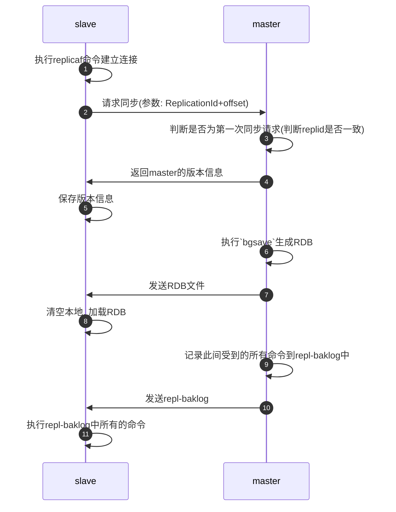
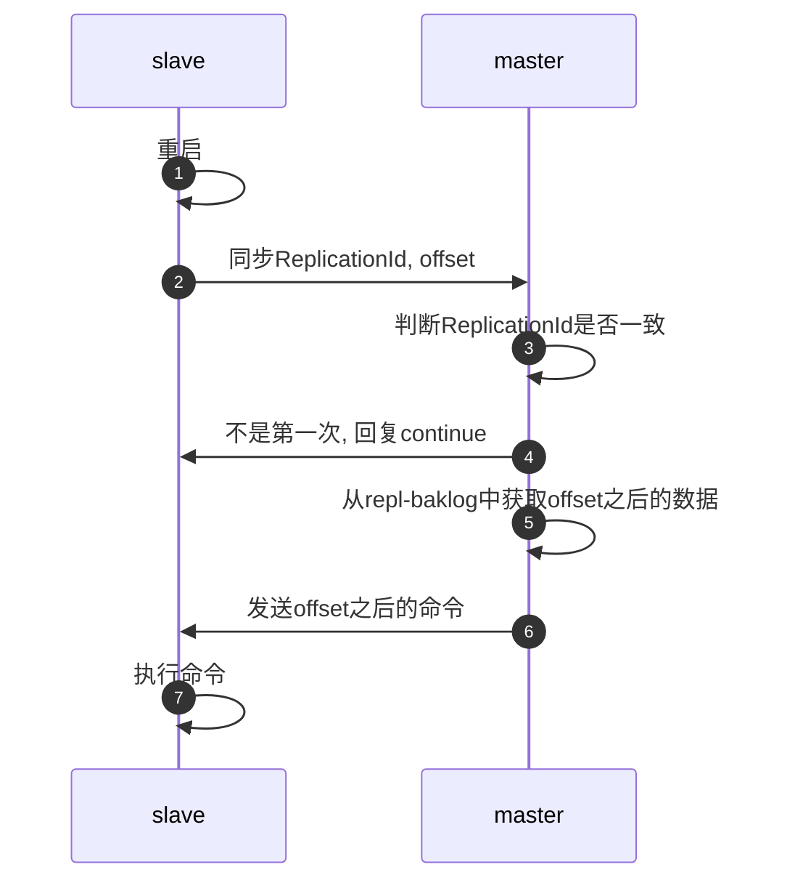

Redis是非常常用的KV数据库, 使用内存以及HashMap进行存储的特点带来了高效的查询. 本文将围绕Redis的常见开发使用场景, 阐述在Redis集群中各个节点是如何进行数据同步, 每个节点如何进行持久化以及在长期使用中如何对数据进行更新和淘汰. 

<!-- more -->
::: center

:::


下面是Redis在开发过程中常用的几种使用场景.

``` mindmap
Redis的使用场景
  缓存
    穿透, 雪崩
    双写一致性
    持久化
    过期淘汰策略
  分布式锁
    setnx
    redission
  计数器
  认证token
  消息队列
  延迟队列
```
## 集群
Redis对于集群的部署支持三种模式: 主从, 哨兵和分片. 在正式的生产环境中一般会采用一主一从+哨兵的模式来解决高可用和高并发读的问题, 但是这种模式无法解决高并发写的问题. 高并发写可以借助于分片集群.

### 主从模式
由于单个服务器的并发数量存在上限, 我们可以使用主从模式实现读写分离, 以此提高读写的效率. 通常主节点进行写操作, 从节点进行读操作.

在主从模式中主节点和从节点之间存在数据同步的问题, 目前Redis支持两种不同的同步方式: 全量同步和增量同步.

#### 全量同步
在了解全量同步的流程之前, 我们先熟悉几个Redis内部的定义:
1. ReplicationId: 数据集标记, id一致说明是同一个数据集.
2. repl-baklog: 命令的日志文件. 主要用于记录同步过程中master生成快照到slave拷贝快照这段时间master接受的命令.
3. offset: repl-baklog的偏移量. slave的offset如果小于master则说明版本落后于master, 需要更新.

下面是全量同步的流程时序图:



::: tip
步骤9实际上记录了步骤6到步骤10之间master收到的所有命令.
:::


#### 增量同步
在了解过全量同步后, 再来对比看一下增量同步的流程. 增量同步主要用于slave节点重启后或者后期出现数据变化的场景.



### 哨兵模式
哨兵模式主要用来实现主从集群的自动恢复. 主要的功能有三个:
1. ***监控:*** 检查master和slave是否正常工作
2. ***自动恢复:*** 如果master出现故障, 提升slave为master
3. ***通知:*** 集群发生故障转移时, 将最新的信息推送给Redis客户端

#### 监控
用心跳机制, 每隔15s发一次`ping`确保节点的状态保持活跃. 节点下线分为两种情况:
1. ***主观下线:*** 某个节点超时未响应.
2. ***客观下线:*** 超过阈值数量的哨兵认为某节点下线. 阈值变量为`quorum`.

#### 选主
当Redis中的master节点宕机后, 会使用类似Raft的投票机制来进行选主. 选主的标准大致基于以下几个:
1. slave-priority越小
2. offset越小
3. 运行id越小

### 分片集群
分片集群主要用于应对海量的数据, 有以下几个特点:
1. 多个master. 每个master都会存储不同的数据
2. 每个master有多个slave
3. master之间会用`ping`检测健康
4. client可访问任意的节点进行读写, 内部会将请求自动转发到正确的节点上

那么如果不同的master存储的是不同的数据, Redis又是如何决定每一个数据应当存储到哪个节点上呢? Redis使用的是插槽, 一共有16384个插槽. 大致过程为: 首先根据key的有效部分计算Hash值, 再与16384取余决定其插槽位置, 再去取数据.

至于为什么插槽的数量定为16384, 其作者有做过[正式答复](https://github.com/antirez/redis/issues/2576):

::: card  title="why redis-cluster use 16384 slots?"
- Normal heartbeat packets carry the full configuration of a node, that can be replaced in an idempotent way with the old in order to update an old config. This means they contain the slots configuration for a node, in raw form, that uses 2k of space with16k slots, but would use a prohibitive 8k of space using 65k slots.
- At the same time it is unlikely that Redis Cluster would scale to more than 1000 mater nodes because of other design tradeoffs.
So 16k was in the right range to ensure enough slots per master with a max of 1000 maters, but a small enough number to propagate the slot configuration as a raw bitmap easily. Note that in small clusters the bitmap would be hard to compress because when N is small the bitmap would have slots/N bits set that is a large percentage of bits set.
::: 

## 持久化
Redis一共提供两种持久化的策略: RDB和AOF, 现在我们分别来看一下这两种策略的优缺点.

### RDB
RDB是基于快照的全量备份, 周期性地把全量的数据写入快照文件.

::: tip 优点
1. 恢复快. 因为是全量数据直接恢复就好
2. 主进程不进行I/O, 对节点影响小
:::

::: danger 缺点
1. 丢失间隔. RDB是快照文件, 两个快照之间节点宕机会导致快照之间的修改会丢失
2. 老版本无法兼容. RDB文件格式与Redis的版本息息相关, 不同版本可能无法使用相同的RDB进行恢复
3. 设置的备份的间隔时间过长, RDB太大的时候可能导致服务暂停
:::

### AOF
AOF策略是对内存修改进行指令记录.

::: tip 优点
1. 不会出现数据丢失. 最多丢失1s的数据
2. 没有磁盘寻址开销. 因为日志是追加写入(append-only)
3. 日志可读. 该场景可以用于紧急恢复, 例如误删了重要数据后, 可以趁着文件还未更新前将AOF保存下来.
:::

::: danger 缺点
1. AOF日志比RDB更大. 因为AOF是指令文件, RDB是二进制文件
2. 性能低. 因为备份间隔更小
3. 恢复慢. 需要执行一遍AOF中的指令才能恢复
:::


## 过期淘汰机制
随着Redis集群的使用时间不断增加, 里面保存的KV越来越多, 此时就会面临内存不够用的问题. Redis为此提供了过期和淘汰策略来管理海量的数据.

### 过期策略
顾名思义就是每一个数据在Redis当中都有一个"寿命", 当过了设定的有效时间该数据就会变为无效的数据, 不再支持读写. Redis提供两种过期策略:
1. ***定期删除:*** 每隔100ms随机删除部分过期key. 这里只删除部分的原因是如果进行全量扫描会导致Redis性能过低. 如果想要调整扫描间隔可以修改参数`h2`.
2. ***惰性删除:*** 不进行定期扫描, 仅仅在查询的时候判断该key是否过期, 如果过期则删除

还有一些额外的场景下Redis会对过期的key进行统一的处理:
1. RDB生成和载入
2. AOF的写入和重写
3. 主从同步
以上几种场景中都会过滤过期的key, 即过期的key不会进入快照文件或者被同步到slave节点.

### 淘汰机制

| 序号 | 名称            | 定义                                                        |
| ---- | --------------- | ----------------------------------------------------------- |
| 1    | volatile_LRU    | 设置了过期时间的key中执行LRU算法                            |
| 2    | allkeys-LRU     | 在所有key中执行LRU算法                                      |
| 3    | volatile_LFU    | 设置了过期时间的key中执行LFU算法                            |
| 4    | allkeys-LFU     | 在所有key中执行LFU算法(删除最不常用的key)                   |
| 5    | volatile_random | 设置了过期时间的key中执行随机删除                           |
| 6    | allkeys-random  | 在所有key中执行随机删除                                     |
| 7    | volatile_TTL    | 删除过期时间最早的key                                       |
| 8    | noeviction      | 不进行key的删除(**默认配置, 但是正常开发中不会使用该模式**) |


